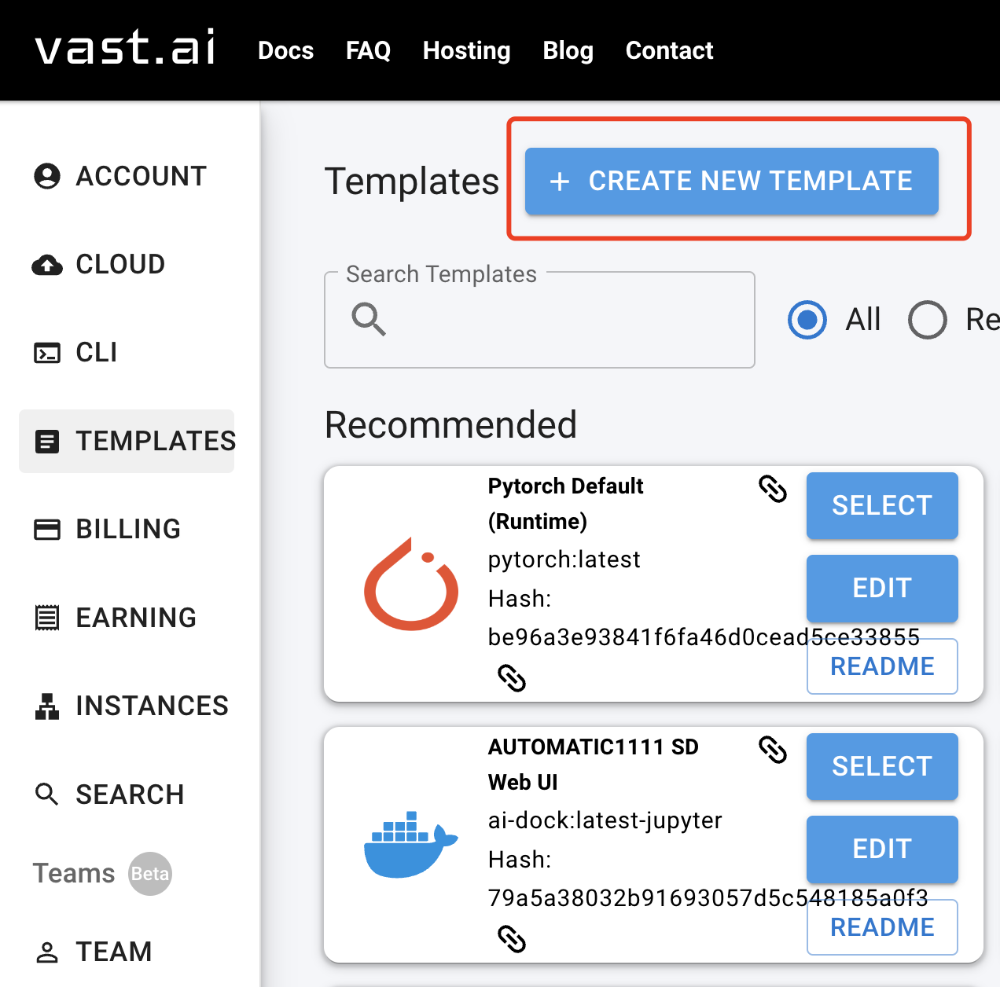
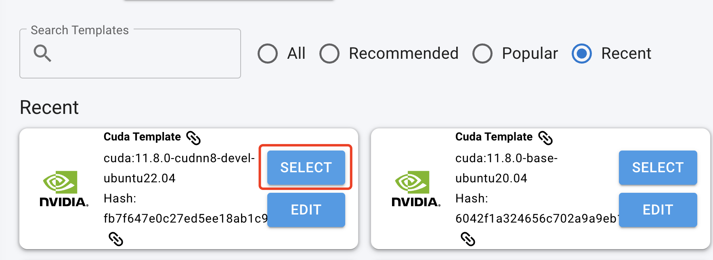
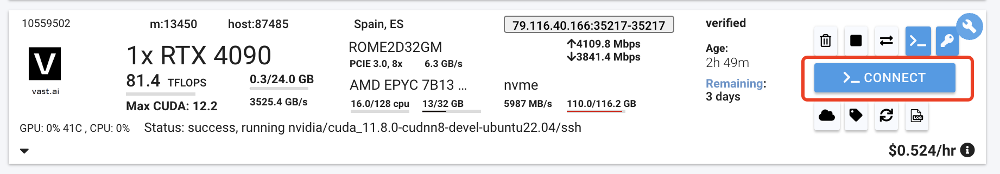

# Set up a Vast.ai instance

## Part I. The vast.ai side

Create an account on [vast.ai](https://vast.ai/), then under `Console -> Templates -> Create New Template`, 

<p align="center"></p>

Fill `nvidia/cuda:11.8.0-cudnn8-devel-ubuntu22.04` in "Image Path/Tag", scroll down to the bottom and click `Select and Save`

(You can choose any other templates you like)

Go back to `Templates`, now you should be able to find the template we just created after checking `Recent` button

<p align="center"></p>

Click `Select` and pick an instance you like, Note that you can choose the disk space and any other settings on the left.

Finally, you shoule be able to see the instance under `Instances`. Get the info for ssh when it is available.

<p align="center"></p>

## Part II. Set up the environment

After connecting to the server via ssh, run

```bash
export CUDA_HOME=/usr/local/cuda-11.8
export PATH="/usr/local/cuda-11.8/bin:$PATH"
export LD_LIBRARY_PATH="/usr/local/cuda-11.8/lib64:$LD_LIBRARY_PATH"
# may check the result of "nvcc --version" and "nvidia-smi"

# some useful tools
yes | sudo apt-get update
yes | sudo apt-get install vim
sudo apt-get install unzip
yes |  sudo apt-get install build-essential
yes | apt-get install libgl1
```

Now everything is set!

Personally I use following commands to install Rust and Conda:

```bash
# install Rust compiler
curl --proto '=https' --tlsv1.2 -sSf https://sh.rustup.rs | sh
source $HOME/.cargo/env

# install Conda
wget https://repo.anaconda.com/archive/Anaconda3-2024.02-1-Linux-x86_64.sh
sh Anaconda3-2024.02-1-Linux-x86_64.sh
export ANACONDA_INSTALL_DIR=/root/anaconda3/
export PATH=$ANACONDA_INSTALL_DIR/bin:$PATH
```

